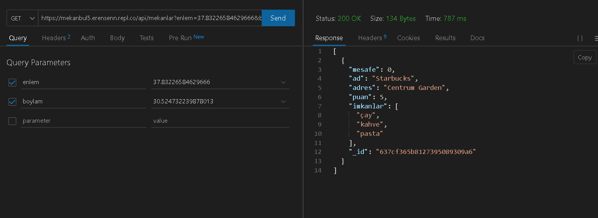
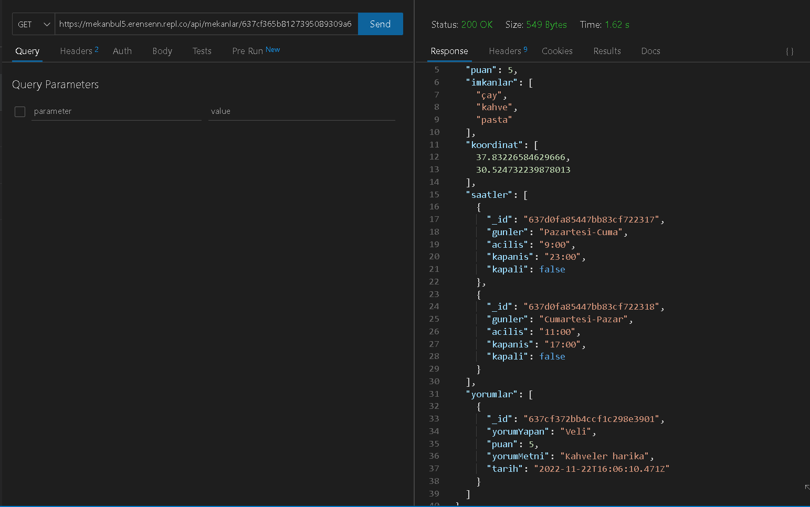
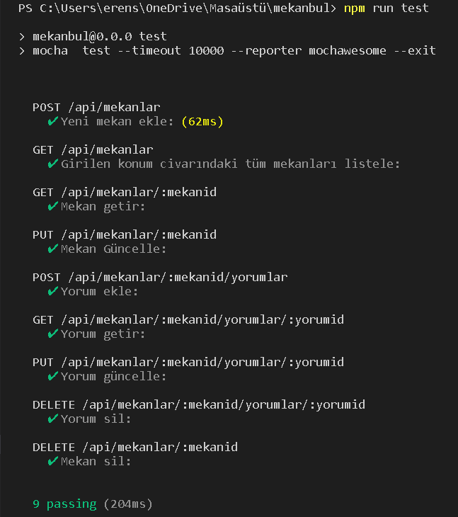

# MekanBul REST API Adresleri
### [1. Girilen Konum Civarındaki Mekanları Listele](https://mekanbul.erensenn.repl.co/api/mekanlar?enlem=37.83226584629666&boylam=30.524732239878013)

### [2. Mekan ID ile Mekan Bilgileri Getir](https://mekanbul.erensenn.repl.co/api/mekanlar/637cf365b8127395089309a6)

### [3. Bir Mekana Ait Belirli Bir Yorumu Getir](https://mekanbul.erensenn.repl.co/api/mekanlar/637cf365b8127395089309a6/yorumlar/637cf372bb4ccf1c298e3901)

### 4.Thunder Client Test

### 5.API Test

